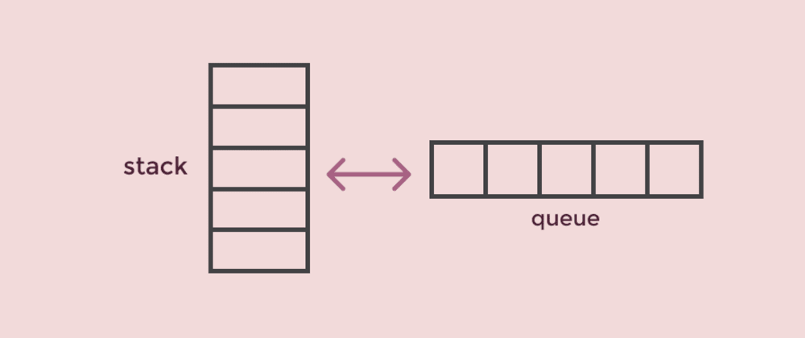

# Stacks and Queues

## - What is a Stack ?
### * A stack is a data structure that consists of Nodes. Each Node references the next Node in the stack, but does not reference its previous.

### FILO : First In Last Out
#### * This means that the first item added in the stack will be the last item popped out of the stack.

### LIFO : Last In First Out
#### * This means that the last item added to the stack will be the first item popped out of the stack.

## stack methods

`push(value)
// INPUT <-- value to add, wrapped in Node internally
// OUTPUT <-- none
   node = new Node(value)
   node.next <-- Top
   top <-- Node`

` pop()
// INPUT <-- No input
// OUTPUT <-- value of top Node in stack
// EXCEPTION if stack is empty
   Node temp <-- top
   top <-- top.next
   temp.next <-- null
   return temp.value`

` peek()
// INPUT <-- none
// OUTPUT <-- value of top Node in stack
// EXCEPTION if stack is empty
   return top.value`
   
`isEmpty()
// INPUT <-- none
// OUTPUT <-- boolean
return top = NULL`

## - What is a Queue ?
### a queue is a collection of entities that are maintained in a sequence and can be modified by the addition of entities at one end of the sequence and the removal of entities from the other end of the sequence

## stack methods

` enqueue(value)
// INPUT <-- value to add to queue (will be wrapped in Node internally)
// OUTPUT <-- none
   node = new Node(value)
   rear.next <-- node
   rear <-- node`

` dequeue()
// INPUT <-- none
// OUTPUT <-- value of the removed Node
// EXCEPTION if queue is empty
   Node temp <-- front
   front <-- front.next
   temp.next <-- null
   return temp.value`

` peek()
// INPUT <-- none
// OUTPUT <-- value of the front Node in Queue
// EXCEPTION if Queue is empty
   return front.value`

` isEmpty()
// INPUT <-- none
// OUTPUT <-- boolean
return front = NULL`

## Sources:
- ### google
- ### https://codefellows.github.io/common_curriculum/data_structures_and_algorithms/Code_401/class-10/resources/stacks_and_queues.html